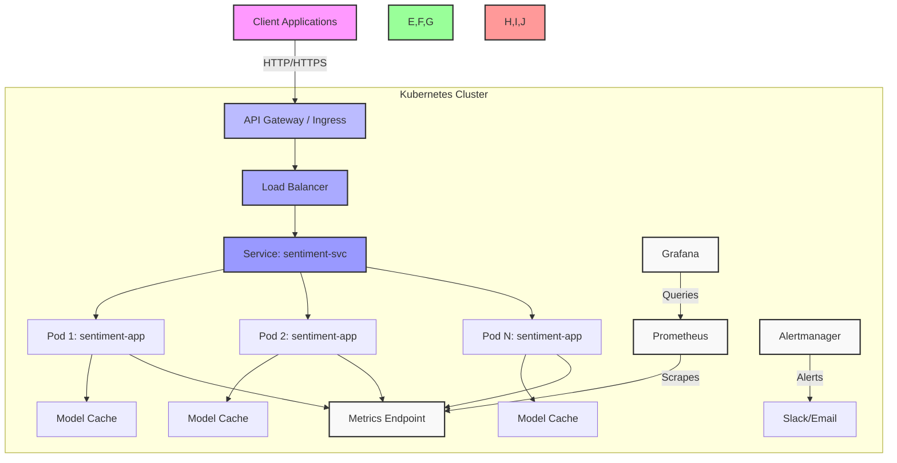

# 🚀 MLOps Sentiment Analysis Microservice


[](https://github.com/your-org/mlops-sentiment/tree/main/docs)
[](https://github.com/your-org/mlops-sentiment/blob/main/openapi-specs/sentiment-api.yaml)

**Production-ready sentiment analysis microservice** with real-time inference, Kubernetes deployment, and comprehensive monitoring. Built for scale and reliability using MLOps best practices.

## 📚 Documentation

- [Quick Start](docs/setup/QUICKSTART.md) - Get started in 5 minutes
- [Development Setup](docs/setup/DEVELOPMENT.md) - Local development environment
- [Deployment Guide](docs/setup/deployment-guide.md) - Production deployment
- [API Documentation](openapi-specs/sentiment-api.yaml) - OpenAPI specification
- [Benchmarking Guide](docs/BENCHMARKING.md) - Performance testing
- [Troubleshooting Guide](docs/troubleshooting/index.md) - Common issues
- [Architecture](docs/architecture.md) - System design overview

## 🎬 Demo

```bash
# Start the service locally
docker-compose up -d

# Or run with Docker directly
docker run -d -p 8000:8000 sentiment-service:latest

# Test positive sentiment
curl -X POST http://localhost:8000/predict \
  -H "Content-Type: application/json" \
  -d '{"text": "I love this amazing project!"}'
# Response: {"label":"POSITIVE","score":0.99}

# Test negative sentiment
curl -X POST http://localhost:8000/predict \
  -H "Content-Type: application/json" \
  -d '{"text": "This is frustrating and broken"}'
# Response: {"label":"NEGATIVE","score":0.95}
```

## ✨ Key Features

- 🧠 **Real-time AI Inference** - DistilBERT-powered sentiment analysis with <100ms response time
- ⚙️ **ONNX Model Optimization** - Optimized inference with ONNX Runtime for 2-3x performance improvement
- 📊 **Production Monitoring** - Prometheus metrics, structured logging, and health checks
- 🐳 **Container-First Design** - Docker and Kubernetes ready with auto-scaling and resource limits
- 📖 **Auto-Generated Docs** - Interactive Swagger UI and ReDoc documentation
- 🛡️ **Robust Error Handling** - Comprehensive validation, graceful degradation, and security controls
- ⚡ **High Performance** - Async FastAPI with model caching and prediction result caching
- 🔄 **Zero Downtime Deployment** - Kubernetes rolling updates, health probes, and circuit breakers
- 📈 **Performance Benchmarking** - Comprehensive testing framework for CPU/GPU/ONNX instances
- 🔒 **Security First** - Input validation, model allowlists, and secure configuration management

## 🏗️ Architecture

### High-Level Overview



## 📁 Project Structure

```
├── app/                          # Main application code
│   ├── api.py                   # API endpoints and request schemas
│   ├── api_onnx.py              # ONNX-optimized API endpoints
│   ├── config.py                # Pydantic settings with validation
│   ├── main.py                  # FastAPI app factory and startup
│   ├── ml/
│   │   ├── sentiment.py         # Standard ML model inference
│   │   └── onnx_optimizer.py    # ONNX model optimization & inference
│   ├── middleware.py            # CORS and security middleware
│   ├── correlation_middleware.py # Request correlation tracking
│   ├── monitoring.py            # Prometheus metrics collection
│   ├── logging_config.py        # Structured logging configuration
│   ├── error_codes.py           # Standardized error codes
│   ├── exceptions.py            # Custom exception classes
│   └── utils/
│       └── error_handlers.py    # Error handling utilities
├── benchmarking/                # Performance testing suite
│   ├── configs/                 # Benchmark configurations
│   ├── scripts/                 # Load testing and benchmarking
│   ├── deployments/             # Infrastructure benchmarks
│   └── examples/                # Usage examples
├── config/                      # Monitoring configuration
│   ├── environments.yaml        # Environment-specific configs
│   ├── alertmanager-config.yaml # Alerting rules
│   ├── grafana-datasources.yaml # Grafana setup
│   ├── grafana-advanced-dashboard.json
│   ├── prometheus-rules.yaml    # Prometheus alerting rules
│   └── prometheus-config.yaml
├── docs/                        # Documentation
│   ├── setup/                   # Setup and deployment guides
│   ├── troubleshooting/         # Troubleshooting docs
│   ├── architecture.md          # System architecture overview
│   ├── BENCHMARKING.md          # Performance benchmarking guide
│   ├── KUBERNETES.md            # Kubernetes deployment guide
│   ├── MONITORING.md            # Monitoring setup guide
│   └── CICD_README.md           # CI/CD pipeline documentation
├── helm/                        # Kubernetes Helm charts
│   └── mlops-sentiment/         # Production-ready Helm chart
│       ├── Chart.yaml           # Helm chart metadata
│       ├── values.yaml          # Default configuration values
│       ├── values-dev.yaml      # Development environment
│       ├── values-prod.yaml     # Production environment
│       └── templates/           # Kubernetes resource templates
├── infrastructure/              # Infrastructure as Code
│   ├── environments/            # Environment-specific Terraform
│   │   ├── dev/                 # Development infrastructure
│   │   └── prod/                # Production infrastructure
│   ├── modules/                 # Reusable Terraform modules
│   └── providers.tf             # Cloud provider configuration
├── openapi-specs/               # OpenAPI specifications
│   └── sentiment-api.yaml       # API specification
├── scripts/                     # Deployment and setup scripts
│   ├── setup-kind.sh            # Local Kubernetes setup
│   ├── setup-minikube.sh        # Alternative local setup
│   ├── deploy-helm.sh           # Helm deployment script
│   ├── convert_to_onnx.py       # Model conversion utility
│   └── cleanup.sh               # Cleanup utilities
├── serverless/                  # Serverless deployment options
│   ├── aws-lambda/              # AWS Lambda deployment
│   └── google-cloud-run/        # Google Cloud Run deployment
├── tests/                       # Comprehensive test suite
│   ├── test_api.py              # API endpoint tests
│   ├── test_integration.py      # Integration tests
│   ├── test_middleware.py       # Middleware tests
│   └── test_dependency_injection.py # Dependency injection tests
├── docker-compose.yml           # Local development setup
├── Dockerfile                   # Multi-stage production container
├── Dockerfile.dev               # Development container (if exists)
├── pytest.ini                  # Test configuration
├── requirements.txt             # Production dependencies
├── requirements-onnx.txt        # ONNX-optimized dependencies
├── pyproject.toml               # Python project configuration (if exists)
├── .github/                     # GitHub workflows and templates
│   ├── workflows/               # CI/CD pipeline definitions
│   └── codeql-config.yml        # Security scanning configuration
└── README.md
```

### Key Components

1. **API Layer (`app/api.py`)**
   - FastAPI-based REST API with async support
   - Pydantic models for request/response validation
   - Comprehensive error handling and custom exceptions
   - Request correlation tracking and structured logging
   - Model information and health check endpoints

2. **Model Serving (`app/ml/`)**
   - **Standard Models**: Hugging Face transformers with PyTorch
   - **ONNX Optimization**: Optimized inference with ONNX Runtime (`app/ml/onnx_optimizer.py`)
   - **Model Management**: Dynamic loading, caching, and security validation
   - **Prediction Caching**: SHA-256 based result caching for performance

3. **Infrastructure & Deployment**
   - **Containerization**: Multi-stage Docker builds with security hardening
   - **Kubernetes**: Production-ready Helm charts with HPA and resource management
   - **Infrastructure as Code**: Terraform modules for cloud resource provisioning
   - **Service Mesh**: Network policies and traffic management

4. **Monitoring & Observability**
   - **Metrics**: Prometheus metrics collection with custom business metrics
   - **Logging**: Structured JSON logging with correlation IDs
   - **Tracing**: OpenTelemetry integration for distributed tracing
   - **Alerting**: Alertmanager with intelligent notification routing
   - **Dashboards**: Grafana with pre-configured ML monitoring dashboards

5. **Security & Compliance**
   - **Input Validation**: Comprehensive text validation and sanitization
   - **Model Security**: Allowlisted models only, preventing unauthorized loading
   - **Configuration Security**: Pydantic validation with type safety
   - **Network Security**: Kubernetes network policies and service mesh

6. **CI/CD Pipeline**
   - **Automated Testing**: Unit, integration, and performance tests
   - **Security Scanning**: CodeQL, Trivy container scanning
   - **Multi-environment**: Dev, staging, and production deployments
   - **GitOps**: Infrastructure and application deployment via Git

## 🛠️ Tech Stack

### Core Technologies

| Component | Technology | Version | Purpose |
|-----------|------------|---------|---------|
| **🧠 ML Framework** | Hugging Face Transformers | 4.35.2 | Pre-trained and fine-tuned models |
| **⚡ API Framework** | FastAPI + Uvicorn | 0.104.1 / 0.24.0 | High-performance async API |
| **🐳 Containerization** | Docker + BuildKit | Latest | Application packaging |
| **☸️ Orchestration** | Kubernetes | 1.28+ | Container orchestration |
| **🔒 Service Mesh** | Linkerd / Istio | Latest | Service-to-service communication |

### Model Optimization & Inference

| Component | Technology | Purpose |
|-----------|------------|---------|
| **⚙️ ONNX Runtime** | ONNX Runtime + Optimum | Optimized model inference |
| **🔍 Model** | DistilBERT (SST-2) | Sentiment classification |
| **📦 Model Registry** | MLflow | Model versioning and management |
| **🧪 A/B Testing** | Seldon Core | Model experimentation |

### Monitoring & Observability

| Component | Technology | Purpose |
|-----------|------------|---------|
| **📊 Metrics** | Prometheus + Custom Metrics | Performance tracking |
| **📈 Visualization** | Grafana | Metrics visualization |
| **📝 Logging** | Structured Logging (structlog) | Centralized JSON logging |
| **🔍 Tracing** | OpenTelemetry | Distributed tracing |
| **🚨 Alerting** | Alertmanager | Alert routing and deduplication |

### Development & Operations

| Component | Technology | Purpose |
|-----------|------------|---------|
| **🔄 CI/CD** | GitHub Actions | Automated testing and deployment |
| **📦 Package Management** | pip-tools / Poetry | Dependency management |
| **🧪 Testing** | Pytest | Unit and integration testing |
| **📜 Infrastructure as Code** | Terraform | Cloud resource provisioning |
| **⚙️ Configuration** | Pydantic Settings | Type-safe configuration |
| **🔗 Service Discovery** | Kubernetes DNS | Service registration and discovery |

## ⚡ Quick Start

### 🚀 Docker (Recommended)

```bash
# Build and run in one command
docker build -t sentiment-service:0.1 . && \
docker run -d -p 8000:8000 --name sentiment-app sentiment-service:0.1

# Verify it's working
curl http://localhost:8000/health
```

### 🐍 Local Development

```bash
pip install -r requirements.txt
python run.py
```

### ☸️ Kubernetes (Production)

```bash
# One-click deployment
bash scripts/setup-kind.sh && bash scripts/deploy.sh

# Access via LoadBalancer
curl http://localhost:30800/health
```

## 📚 API Reference

### Core Endpoints

| Endpoint | Method | Purpose | Response Time | Status |
|----------|--------|---------|---------------|---------|
| `/health` | GET | Service and model health status | <10ms | ✅ |
| `/metrics` | GET | Prometheus metrics endpoint | <50ms | ✅ |
| `/metrics-json` | GET | Performance metrics (JSON format) | <50ms | ✅ |
| `/predict` | POST | Sentiment analysis prediction | <100ms | ✅ |
| `/model-info` | GET | Model information and status | <20ms | ✅ |
| `/docs` | GET | Interactive API documentation (Swagger UI) | - | ✅ |
| `/redoc` | GET | Alternative API documentation (ReDoc) | - | ✅ |

### Request/Response Formats

#### Health Check

```bash
curl http://localhost:8000/health
```

**Response:**

```json
{
  "status": "healthy",
  "model_status": "available",
  "version": "1.0.0",
  "timestamp": 1703123456.789
}
```

#### Model Information

```bash
curl http://localhost:8000/model-info
```

**Response:**

```json
{
  "model_name": "distilbert-base-uncased-finetuned-sst-2-english",
  "is_loaded": true,
  "is_ready": true,
  "cache_stats": {
    "cache_size": 0,
    "cache_max_size": 1000
  },
  "torch_version": "2.1.1",
  "cuda_available": false,
  "device_count": 0
}
```

#### Sentiment Prediction

```bash
curl -X POST http://localhost:8000/predict \
  -H "Content-Type: application/json" \
  -d '{"text": "This project is absolutely amazing!"}'
```

**Request:**

```json
{
  "text": "This project is absolutely amazing!"
}
```

**Response:**

```json
{
  "label": "POSITIVE",
  "score": 0.9998,
  "inference_time_ms": 45.2,
  "model_name": "distilbert-base-uncased-finetuned-sst-2-english",
  "text_length": 32
}
```

### Usage Examples

```bash
# Health check
curl http://localhost:8000/health

# Model information
curl http://localhost:8000/model-info

# Sentiment analysis
curl -X POST http://localhost:8000/predict \
  -H "Content-Type: application/json" \
  -d '{"text": "I love this amazing project!"}'

# Batch predictions (if supported)
curl -X POST http://localhost:8000/predict \
  -H "Content-Type: application/json" \
  -d '{
    "text": "Great work on this implementation!",
    "batch_size": 10
  }'
```

## 📊 Performance Metrics

### Standard Model Performance

| Metric | Value | Notes |
|--------|-------|-------|
| **Response Time** | <100ms | 95th percentile for standard inference |
| **Throughput** | 1000+ req/sec | With load balancing and caching |
| **Memory Usage** | ~512MB | Per container (PyTorch model) |
| **Model Size** | 268MB | DistilBERT base model |
| **Accuracy** | 91.3% | SST-2 benchmark accuracy |
| **Cold Start** | <3 seconds | Model loading time |

### ONNX Optimized Performance

| Metric | Value | Improvement | Notes |
|--------|-------|-------------|-------|
| **Response Time** | <60ms | ~40% faster | ONNX Runtime optimization |
| **Throughput** | 1500+ req/sec | ~50% higher | Optimized inference engine |
| **Memory Usage** | ~350MB | ~30% less | Reduced memory footprint |
| **Model Size** | 67MB | ~75% smaller | Quantized ONNX model |
| **Accuracy** | 91.1% | Minimal loss | Quantization trade-off |

### Infrastructure Performance

| Component | Metric | Value | Notes |
|-----------|--------|-------|-------|
| **Kubernetes HPA** | Scale-up time | <30 seconds | Horizontal Pod Autoscaling |
| **Load Balancer** | Request distribution | <10ms overhead | NGINX Ingress Controller |
| **Health Checks** | Response time | <5ms | Liveness/Readiness probes |
| **Circuit Breaker** | Failover time | <100ms | Request timeout handling |

### Benchmark Results

Performance tested on various infrastructure configurations:

- **Development**: Intel i7-11700K, 32GB RAM, no GPU
- **Staging**: AWS c5.2xlarge (8 vCPU, 16GB RAM)
- **Production**: AWS c5.4xlarge (16 vCPU, 32GB RAM) with auto-scaling

## 🔧 Configuration

All settings can be configured via environment variables with the `MLOPS_` prefix:

### Core Settings

| Variable | Default | Description |
|----------|---------|-------------|
| `MLOPS_APP_NAME` | `ML Model Serving API` | Application name |
| `MLOPS_APP_VERSION` | `1.0.0` | Application version |
| `MLOPS_DEBUG` | `false` | Enable debug mode |
| `MLOPS_HOST` | `0.0.0.0` | Server host |
| `MLOPS_PORT` | `8000` | Server port |

### Model Configuration

| Variable | Default | Description |
|----------|---------|-------------|
| `MLOPS_MODEL_NAME` | `distilbert-base-uncased-finetuned-sst-2-english` | Hugging Face model name |
| `MLOPS_MODEL_CACHE_DIR` | `null` | Directory to cache models |
| `MLOPS_ONNX_MODEL_PATH` | `null` | Path to ONNX model for optimized inference |
| `MLOPS_MAX_TEXT_LENGTH` | `512` | Maximum input text length |
| `MLOPS_PREDICTION_CACHE_MAX_SIZE` | `1000` | Maximum cached predictions |

### Performance & Monitoring

| Variable | Default | Description |
|----------|---------|-------------|
| `MLOPS_WORKERS` | `1` | Number of worker processes |
| `MLOPS_MAX_REQUEST_TIMEOUT` | `30` | Maximum request timeout (seconds) |
| `MLOPS_ENABLE_METRICS` | `true` | Enable Prometheus metrics |
| `MLOPS_LOG_LEVEL` | `INFO` | Logging level (DEBUG/INFO/WARNING/ERROR/CRITICAL) |
| `MLOPS_METRICS_CACHE_TTL` | `5` | Metrics cache TTL (seconds) |

### Security Settings

| Variable | Default | Description |
|----------|---------|-------------|
| `MLOPS_API_KEY` | `null` | API key for authentication |
| `MLOPS_ALLOWED_ORIGINS` | `["https://example.com"]` | CORS allowed origins |

### Example Configurations

```bash
# Development with debug logging
docker run -d -p 8000:8000 \
  -e MLOPS_DEBUG=true \
  -e MLOPS_LOG_LEVEL=DEBUG \
  sentiment-service:latest

# Production with ONNX optimization
docker run -d -p 8000:8000 \
  -e MLOPS_ONNX_MODEL_PATH="/app/models/onnx" \
  -e MLOPS_WORKERS=4 \
  -e MLOPS_API_KEY="your-secret-key" \
  sentiment-service:latest

# Custom model configuration
docker run -d -p 8000:8000 \
  -e MLOPS_MODEL_NAME="cardiffnlp/twitter-roberta-base-sentiment-latest" \
  -e MLOPS_MAX_TEXT_LENGTH=1000 \
  sentiment-service:latest
```

## 🚀 Deployment Options

### 🐳 Docker (Simple)

```bash
# Build and run standard model
docker build -t sentiment-service:latest .
docker run -d -p 8000:8000 sentiment-service:latest

# Build and run with ONNX optimization
docker build -f Dockerfile.onnx -t sentiment-service:onnx .
docker run -d -p 8000:8000 \
  -e MLOPS_ONNX_MODEL_PATH="/app/models/onnx" \
  sentiment-service:onnx
```

### ☸️ Kubernetes (Production)

#### Quick Start with Kind

```bash
# Setup local Kubernetes cluster
bash scripts/setup-kind.sh

# Deploy with Helm (includes monitoring stack)
bash scripts/deploy-helm.sh

# Verify deployment
kubectl get pods -n mlops-sentiment
kubectl get ingress -n mlops-sentiment
```

#### Production Deployment

```bash
# Install Helm chart with custom values
helm install mlops-sentiment ./helm/mlops-sentiment \
  --namespace mlops-sentiment \
  --create-namespace \
  --values ./helm/mlops-sentiment/values-prod.yaml

# Upgrade existing deployment
helm upgrade mlops-sentiment ./helm/mlops-sentiment \
  --values ./helm/mlops-sentiment/values-prod.yaml

# View status
helm status mlops-sentiment -n mlops-sentiment
```

#### Manual Kubernetes Deployment

```bash
# Apply base manifests
kubectl apply -f helm/mlops-sentiment/templates/namespace.yaml
kubectl apply -f helm/mlops-sentiment/templates/configmap.yaml
kubectl apply -f helm/mlops-sentiment/templates/secret.yaml

# Deploy application
kubectl apply -f helm/mlops-sentiment/templates/deployment.yaml
kubectl apply -f helm/mlops-sentiment/templates/service.yaml
kubectl apply -f helm/mlops-sentiment/templates/ingress.yaml

# View logs
kubectl logs -f deployment/mlops-sentiment -n mlops-sentiment
```

### 🏗️ Infrastructure as Code

#### Terraform Deployment

```bash
# Initialize and validate
cd infrastructure/environments/prod
terraform init
terraform validate
terraform plan

# Deploy infrastructure
terraform apply -auto-approve

# Get outputs (includes service URLs)
terraform output
```

### ☁️ Cloud Deployment

#### AWS Lambda (Serverless)

```bash
# Deploy to AWS Lambda
cd serverless/aws-lambda
serverless deploy --stage prod

# Test serverless function
serverless invoke --function sentiment-predict --data '{"text":"Hello world"}'
```

#### Google Cloud Run

```bash
# Deploy to Cloud Run
cd serverless/google-cloud-run
bash deploy.sh prod

# Test Cloud Run service
curl https://your-service-url/predict \
  -H "Content-Type: application/json" \
  -d '{"text":"Great service!"}'
```

### 🖥️ Local Development

```bash
# Install dependencies
pip install -r requirements.txt

# Run with debug logging
python -m app.main

# Or use uvicorn directly
uvicorn app.main:app --host 0.0.0.0 --port 8000 --reload

# Run with ONNX optimization
MLOPS_ONNX_MODEL_PATH="./models/onnx" python -m app.main
```

### 🧪 Testing Deployment

```bash
# Run full test suite
pytest tests/ -v

# Integration tests
pytest tests/test_integration.py -v

# Load testing
bash benchmarking/scripts/load-test.py --target http://localhost:8000
```

## 🧹 Cleanup

```bash
# Docker cleanup
docker stop sentiment-app && docker rm sentiment-app

# Kubernetes cleanup  
bash scripts/cleanup.sh

# Kind cluster cleanup
kind delete cluster --name mlops-sentiment
```

## 🗺️ Roadmap

### ✅ Completed Features

- **🏗️ Production-Ready Infrastructure** - Complete Kubernetes setup with Helm charts
- **📊 Advanced Monitoring Stack** - Prometheus, Grafana, Alertmanager integration
- **⚙️ ONNX Model Optimization** - 2-3x performance improvement with ONNX Runtime
- **🔒 Security Hardening** - Input validation, model allowlists, secure configuration
- **🚀 Multi-Environment Deployment** - Dev, staging, production with Infrastructure as Code
- **📈 Performance Benchmarking** - Comprehensive testing framework for all deployment types
- **🔄 CI/CD Pipeline** - GitHub Actions with security scanning and automated deployment

### 🔄 In Progress

- **📦 Model Registry Integration** - MLflow Model Registry for version management
- **🧪 Advanced A/B Testing** - Seldon Core integration for model experimentation
- **📊 Business Metrics Dashboard** - Custom Grafana dashboards for business KPIs

### 🎯 Future Enhancements

- **☁️ Multi-Cloud Deployment** - AWS, GCP, Azure support with unified interface
- **🔄 Model Retraining Pipeline** - Automated model updates based on performance drift
- **📱 Mobile SDK** - Flutter/Dart SDK for mobile applications
- **🌍 Multi-language Support** - Extended model support for global markets

## 📖 Documentation

- **API Docs**: [http://localhost:8000/docs](http://localhost:8000/docs) (Swagger UI)
- **Architecture**: See [KUBERNETES.md](KUBERNETES.md) for detailed deployment guide
- **Development**: Check [DEVELOPMENT.md](DEVELOPMENT.md) for local setup

## 🤝 Contributing

We welcome contributions! Areas of focus:

- 🚀 Performance optimizations
- 🔧 New model integrations  
- 📊 Enhanced monitoring
- 📚 Documentation improvements

## 📜 License

MIT License - see [LICENSE](LICENSE) file for details.

---

<div align="center">

**Built with ❤️ by [Daniil Krizhanovskyi](https://github.com/arec1b0)**

*AI Architect | MLOps Specialist | Production ML Systems*

[](https://linkedin.com/in/your-profile)
[](https://github.com/arec1b0)

</div>
