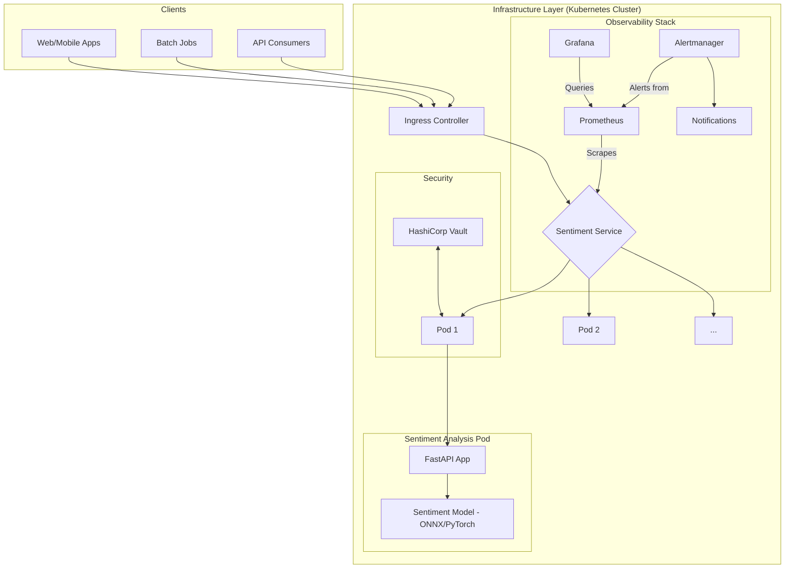

# KubeSentiment: Production-Ready MLOps Sentiment Analysis Microservice

[](https://github.com/arec1b0/mlops-sentiment/actions)
[](https://github.com/arec1b0/mlops-sentiment/releases)
[](LICENSE)
[](https://example.com/coverage)
[](https://example.com/quality)

**KubeSentiment** is a production-grade, scalable, and observable sentiment analysis microservice. Built with FastAPI and designed for Kubernetes, it embodies modern MLOps best practices from the ground up, providing a robust foundation for deploying machine learning models in a cloud-native environment.

## ✨ Why KubeSentiment?

This project was built to serve as a comprehensive, real-world example of MLOps principles in action. It addresses common challenges in deploying ML models, such as:

- **Scalability**: Handles high-throughput inference with Kubernetes Horizontal Pod Autoscaling.
- **Observability**: Offers deep insights into model and system performance with a pre-configured monitoring stack.
- **Reproducibility**: Ensures consistent environments from development to production with Docker, Terraform, and Helm.
- **Security**: Integrates best practices for secret management, container security, and network policies.
- **Automation**: Features a complete CI/CD pipeline for automated testing and deployment.

## 🚀 Key Features

- **High-Performance AI Inference**: Leverages state-of-the-art transformer models for real-time sentiment analysis.
- **ONNX Optimization**: Supports ONNX Runtime for accelerated inference and reduced resource consumption.
- **Cloud-Native & Kubernetes-Ready**: Designed for Kubernetes with auto-scaling, health checks, and zero-downtime deployments via Helm.
- **Full Observability Stack**: Integrated with Prometheus, Grafana, and structured logging for comprehensive monitoring.
- **Infrastructure as Code (IaC)**: Reproducible infrastructure defined with Terraform.
- **Automated CI/CD Pipeline**: GitHub Actions for automated testing, security scanning (Trivy), and deployment.
- **Secure by Design**: Integrates with HashiCorp Vault for secrets management and includes hardened network policies.
- **Comprehensive Benchmarking**: Includes a full suite for performance and cost analysis across different hardware configurations.

## 🏛️ Architecture Overview

The system is designed as a modular, cloud-native application. At its core is the FastAPI service, which serves the sentiment analysis model. This service is containerized and deployed to a Kubernetes cluster, with a surrounding ecosystem for monitoring, security, and traffic management.



For a deeper dive into the technical design, components, and patterns used, please see the **[Architecture Document](docs/architecture.md)**.

## 🏁 Getting Started

### Prerequisites

Ensure you have the following tools installed on your local machine:

- **Python 3.11+**
- **Docker & Docker Compose**
- **kubectl** (for Kubernetes interaction)
- **Helm 3+** (for Kubernetes package management)
- **make** (optional, for using Makefile shortcuts)

### 1. Local Development (Docker Compose)

This is the quickest way to get the service running on your local machine.

1.  **Clone the repository:**
    ```bash
    git clone https://github.com/arec1b0/mlops-sentiment.git
    cd mlops-sentiment
    ```

2.  **Start the service:**
    ```bash
    docker-compose up --build
    ```
    This will build the Docker image and start the FastAPI service.

3.  **Test the service:**
    Open a new terminal and send a prediction request:
    ```bash
    curl -X POST "http://localhost:8000/predict" \
         -H "Content-Type: application/json" \
         -d '{"text": "This is an amazing project and the setup was so easy!"}'
    ```

    You should receive a response like:
    ```json
    {
      "text": "This is an amazing project and the setup was so easy!",
      "sentiment": {
        "label": "POSITIVE",
        "score": 0.9998
      }
    }
    ```

### 2. Full Kubernetes Deployment with Monitoring

To experience the full MLOps stack, including the monitoring dashboard, you can deploy the entire system to a Kubernetes cluster (e.g., Minikube, kind, or a cloud provider's cluster).

Our **[Quick Start Guide](docs/setup/QUICKSTART.md)** provides a one-line script to get the application and its full monitoring stack running in minutes.

```bash
# Follow the instructions in the Quick Start guide
./scripts/setup-monitoring.sh
```

This will deploy the application along with Prometheus for metrics, Grafana for dashboards, and Alertmanager for alerts.

## 💻 Usage

### API Endpoints

The service exposes several key endpoints:

| Method | Endpoint              | Description                                      |
|--------|-----------------------|--------------------------------------------------|
| `POST` | `/predict`            | Analyzes the sentiment of the input text.        |
| `GET`  | `/health`             | Health check endpoint for readiness/liveness.    |
| `GET`  | `/metrics`            | Exposes Prometheus metrics.                      |
| `GET`  | `/api/v1/info/model`  | Returns metadata about the loaded ML model.      |

### Configuration

The application is configured via environment variables, which are documented in our **[Deployment Guide](docs/setup/deployment-guide.md)**. For Kubernetes deployments, these are managed via `ConfigMap` and `Secret` objects, which are defined in the Helm chart.

## 📊 Benchmarking

A key part of this project is its ability to measure performance and cost-effectiveness. The `benchmarking/` directory contains a powerful suite for running load tests against the service on different hardware configurations.

This allows you to answer questions like:
- "Is a GPU instance more cost-effective than a CPU instance for my workload?"
- "What is the maximum RPS our current configuration can handle?"

The benchmarking scripts generate a comprehensive HTML report with performance comparisons, cost analysis, and resource utilization charts. See the **[Benchmarking README](benchmarking/README.md)** for more details.

## 🤝 Contributing

We welcome contributions of all kinds! Whether it's reporting a bug, improving documentation, or submitting a new feature, your help is appreciated.

Please read our **[Contributing Guide](CONTRIBUTING.md)** to get started with the development setup, code quality standards, and pull request process.

## 📜 License

This project is licensed under the MIT License. See the [LICENSE](LICENSE) file for details.
