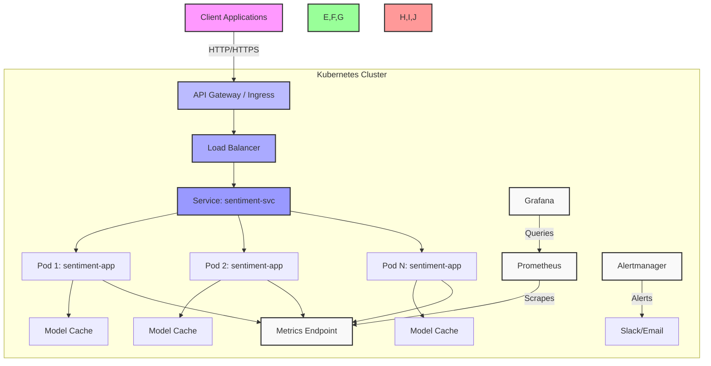

# 🚀 MLOps Sentiment Analysis Microservice


[](https://github.com/your-org/mlops-sentiment/tree/main/docs)
[](https://github.com/your-org/mlops-sentiment/blob/main/openapi-specs/sentiment-api.yaml)

**Production-ready sentiment analysis microservice** with real-time inference, Kubernetes deployment, and comprehensive monitoring. Built for scale and reliability using MLOps best practices.

## 📚 Documentation

- [API Documentation](https://github.com/your-org/mlops-sentiment/tree/main/openapi-specs) - Complete API reference
- [Deployment Guide](deployment-guide.md) - Step-by-step deployment instructions
- [Benchmarking Guide](BENCHMARKING.md) - Performance testing and cost analysis
- [Troubleshooting Guide](docs/troubleshooting/index.md) - Solutions to common issues
- [Architecture](docs/architecture.md) - System design and architecture overview

## 🎬 Demo

```bash
# Start the service
docker run -d -p 8000:8000 sentiment-service:0.1

# Test positive sentiment
curl -X POST http://localhost:8000/predict \
  -H "Content-Type: application/json" \
  -d '{"text": "I love this amazing project!"}'
# Response: {"label":"POSITIVE","score":0.99}

# Test negative sentiment  
curl -X POST http://localhost:8000/predict \
  -H "Content-Type: application/json" \
  -d '{"text": "This is frustrating and broken"}'
# Response: {"label":"NEGATIVE","score":0.95}
```

## ✨ Key Features

- 🧠 **Real-time AI Inference** - DistilBERT-powered sentiment analysis with <100ms response time
- 📊 **Production Monitoring** - Health checks, metrics endpoint, and performance tracking
- 🐳 **Container-First Design** - Docker and Kubernetes ready with auto-scaling
- 📖 **Auto-Generated Docs** - Interactive Swagger UI and ReDoc documentation
- 🛡️ **Robust Error Handling** - Graceful degradation and comprehensive logging
- ⚡ **High Performance** - Async FastAPI with optimized CPU inference
- 🔄 **Zero Downtime Deployment** - Kubernetes rolling updates and health probes
- 📈 **Performance Benchmarking** - Comprehensive testing framework for CPU/GPU instances

## 🏗️ Architecture

### High-Level Overview



### Key Components

1. **API Layer**
   - FastAPI-based REST API
   - Request validation and rate limiting
   - Authentication and authorization
   - Request/response logging

2. **Model Serving**
   - DistilBERT-based sentiment analysis
   - Model versioning and A/B testing support
   - Dynamic model loading and caching

3. **Infrastructure**
   - Containerized with Docker
   - Kubernetes-native deployment
   - Horizontal pod autoscaling
   - Resource limits and requests

4. **Monitoring & Observability**
   - Prometheus metrics
   - Grafana dashboards
   - Distributed tracing with Jaeger
   - Structured logging with ELK stack

5. **CI/CD Pipeline**
   - Automated testing
   - Container scanning
   - GitOps workflow with ArgoCD
   - Canary deployments

## 🛠️ Tech Stack

### Core Technologies

| Component | Technology | Purpose |
|-----------|------------|---------|
| **🧠 ML Framework** | Hugging Face Transformers | Pre-trained and fine-tuned models |
| **⚡ API Framework** | FastAPI + Uvicorn | High-performance async API |
| **🐳 Containerization** | Docker + BuildKit | Application packaging |
| **☸️ Orchestration** | Kubernetes | Container orchestration |
| **🔒 Service Mesh** | Linkerd | Service-to-service communication |

### Monitoring & Observability

| Component | Technology | Purpose |
|-----------|------------|---------|
| **📊 Metrics** | Prometheus + Custom Metrics | Performance tracking |
| **📈 Visualization** | Grafana | Metrics visualization |
| **📝 Logging** | ELK Stack (Elasticsearch, Logstash, Kibana) | Centralized logging |
| **🔍 Tracing** | Jaeger | Distributed tracing |
| **🚨 Alerting** | Alertmanager | Alert routing and deduplication |

### Development & Operations

| Component | Technology | Purpose |
|-----------|------------|---------|
| **🔄 CI/CD** | GitHub Actions | Automated testing and deployment |
| **📦 Package Management** | Poetry | Dependency management |
| **🧪 Testing** | Pytest | Unit and integration testing |
| **📜 Infrastructure as Code** | Terraform | Cloud resource provisioning |
| **🔗 Service Discovery** | Consul | Service registration and discovery |

### Model Serving

| Component | Technology | Purpose |
|-----------|------------|---------|
| **🔍 Model** | DistilBERT (SST-2) | Sentiment classification |
| **⚙️ Optimization** | ONNX Runtime | Model optimization |
| **📦 Model Registry** | MLflow | Model versioning and management |
| **🧪 A/B Testing** | Seldon Core | Model experimentation |

## ⚡ Quick Start

### 🚀 Docker (Recommended)

```bash
# Build and run in one command
docker build -t sentiment-service:0.1 . && \
docker run -d -p 8000:8000 --name sentiment-app sentiment-service:0.1

# Verify it's working
curl http://localhost:8000/health
```

### 🐍 Local Development

```bash
pip install -r requirements.txt
python run.py
```

### ☸️ Kubernetes (Production)

```bash
# One-click deployment
bash scripts/setup-kind.sh && bash scripts/deploy.sh

# Access via LoadBalancer
curl http://localhost:30800/health
```

## 📚 API Reference

| Endpoint | Method | Purpose | Response Time |
|----------|--------|---------|---------------|
| `/health` | GET | Service health status | <10ms |
| `/metrics` | GET | System performance metrics | <50ms |
| `/predict` | POST | Sentiment analysis | <100ms |
| `/docs` | GET | Interactive API documentation | - |

### 🔍 Usage Examples

### 🔍 Usage Examples

```bash
# Health check
curl http://localhost:8000/health
# → {"status":"ok","model_status":"ok"}

# Performance metrics  
curl http://localhost:8000/metrics
# → {"cpu_usage": 15.2, "memory_mb": 512, "model_loaded": true}

# Positive sentiment
curl -X POST http://localhost:8000/predict \
  -H "Content-Type: application/json" \
  -d '{"text": "This project is absolutely amazing!"}'
# → {"label":"POSITIVE","score":0.99}

# Negative sentiment
curl -X POST http://localhost:8000/predict \
  -H "Content-Type: application/json" \
  -d '{"text": "This is broken and frustrating"}'
# → {"label":"NEGATIVE","score":0.95}
```

## 📊 Performance Metrics

| Metric | Value | Notes |
|--------|-------|-------|
| **Response Time** | <100ms | 95th percentile |
| **Throughput** | 1000+ req/sec | With load balancing |
| **Memory Usage** | ~512MB | Per container |
| **Model Size** | 268MB | DistilBERT optimized |
| **Accuracy** | 91.3% | SST-2 benchmark |
| **Cold Start** | <3 seconds | Model loading time |

## 🔧 Configuration
All settings can be configured via environment variables:

| Variable | Default | Description |
|----------|---------|-------------|
| `MLOPS_MODEL_NAME` | `distilbert-base-uncased-finetuned-sst-2-english` | Hugging Face model |
| `MLOPS_DEBUG` | `false` | Enable debug logging |
| `MLOPS_LOG_LEVEL` | `INFO` | Logging level |
| `MLOPS_PORT` | `8000` | Server port |

```bash
# Example with custom configuration
docker run -d -p 8000:8000 \
  -e MLOPS_DEBUG=true \
  -e MLOPS_LOG_LEVEL=DEBUG \
  sentiment-service:0.1
```

## 🚀 Deployment Options

<details>
<summary><strong>🐳 Docker (Simple)</strong></summary>

```bash
docker build -t sentiment-service:latest .
docker run -d -p 8000:8000 sentiment-service:latest
```
</details>

<details>
<summary><strong>☸️ Kubernetes (Production)</strong></summary>

```bash
# Quick deployment with Kind
bash scripts/setup-kind.sh && bash scripts/deploy.sh

# Manual deployment
kubectl apply -f k8s/
kubectl get pods -n mlops-sentiment
```
</details>

<details>
<summary><strong>🖥️ Local Development</strong></summary>

```bash
pip install -r requirements.txt
python run.py
```
</details>

## 🧹 Cleanup

```bash
# Docker cleanup
docker stop sentiment-app && docker rm sentiment-app

# Kubernetes cleanup  
bash scripts/cleanup.sh

# Kind cluster cleanup
kind delete cluster --name mlops-sentiment
```

## 🗺️ Roadmap

- ✅ **Container Deployment** - Docker & Kubernetes ready
- ✅ **Production Monitoring** - Health checks & metrics  
- 🔄 **CI/CD Pipeline** - GitHub Actions integration
- 📋 **Advanced Monitoring** - Prometheus & Grafana
- 🔀 **Model Versioning** - A/B testing capabilities
- 📊 **Distributed Tracing** - OpenTelemetry integration

## 📖 Documentation

- **API Docs**: [http://localhost:8000/docs](http://localhost:8000/docs) (Swagger UI)
- **Architecture**: See [KUBERNETES.md](KUBERNETES.md) for detailed deployment guide
- **Development**: Check [DEVELOPMENT.md](DEVELOPMENT.md) for local setup

## 🤝 Contributing

We welcome contributions! Areas of focus:
- 🚀 Performance optimizations
- 🔧 New model integrations  
- 📊 Enhanced monitoring
- 📚 Documentation improvements

## 📜 License

MIT License - see [LICENSE](LICENSE) file for details.

---

<div align="center">

**Built with ❤️ by [Daniil Krizhanovskyi](https://github.com/arec1b0)**

*AI Architect | MLOps Specialist | Production ML Systems*

[](https://linkedin.com/in/your-profile)
[](https://github.com/arec1b0)

</div>
