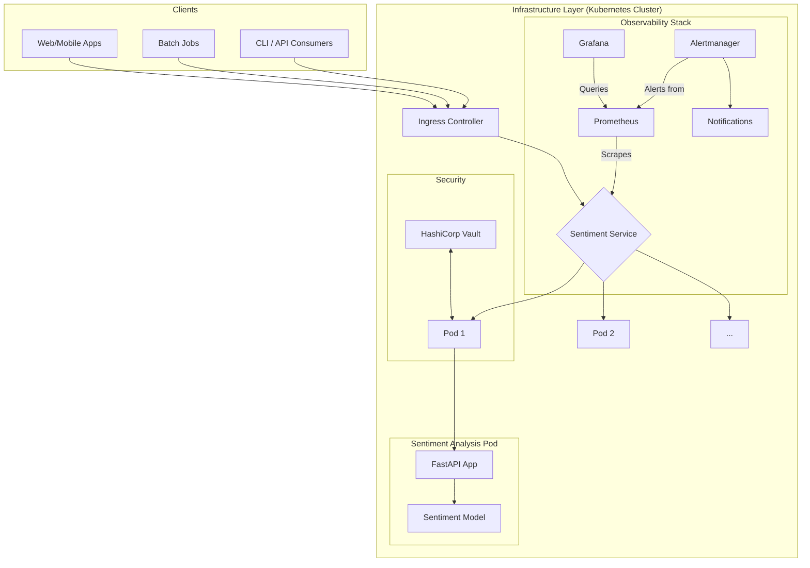

# KubeSentiment Architecture

This document provides a comprehensive overview of the KubeSentiment project's architecture, from the application code to the infrastructure and deployment strategy.

## 1. Guiding Principles

The architecture is designed with the following MLOps principles in mind:

- **Modularity and Separation of Concerns**: Each component has a single, well-defined responsibility.
- **Automation**: CI/CD pipelines automate testing, building, and deployment.
- **Infrastructure as Code (IaC)**: Infrastructure is managed declaratively using Terraform.
- **Observability**: Comprehensive monitoring, logging, and tracing are built-in.
- **Reproducibility**: Environments are containerized with Docker for consistency.
- **Security**: Security is integrated into every layer of the stack.

## 2. System Architecture Overview

KubeSentiment is a cloud-native microservice designed for sentiment analysis. It's built to be scalable, resilient, and maintainable.

## 3. Application Architecture (`app/`)

The application is a FastAPI service with a modular, domain-oriented structure. This design enhances maintainability and testability.

- **`app/core`**: Contains the application's core logic, including configuration (`config.py`), structured logging (`logging.py`), and dependency injection setup.
- **`app/api`**: Defines the API layer, with sub-modules for routes, request/response schemas (Pydantic), and middleware (correlation IDs, logging, authentication).
- **`app/models`**: Manages the machine learning models. It uses a **Factory and Strategy pattern** (`factory.py`, `base.py`) to allow for interchangeable model backends (e.g., `pytorch_sentiment.py`, `onnx_sentiment.py`).
- **`app/services`**: Implements the business logic, acting as an intermediary between the API routes and the models.
- **`app/monitoring`**: Handles observability, exposing Prometheus metrics and health check endpoints. It includes a `routes.py` file that consolidates all monitoring-related API endpoints.
- **`app/utils`**: Contains shared utilities like custom exception classes and error handlers.

## 4. Containerization (`Dockerfile` & `docker-compose.yml`)

The application is containerized using Docker for consistent environments across development and production.

- **`Dockerfile`**: A multi-stage `Dockerfile` is used to create an optimized and secure production image. It builds the application in one stage and copies the necessary artifacts to a smaller, hardened final image. This reduces the attack surface and image size.
- **`docker-compose.yml`**: Provides a simple way to run the application locally for development and testing.

## 5. Infrastructure as Code (`infrastructure/`)

Infrastructure is managed using Terraform, allowing for reproducible and version-controlled environments.

- **`infrastructure/modules`**: Contains reusable Terraform modules for creating resources like Kubernetes clusters (EKS, GKE, AKS, or local `kind` clusters) and integrating with services like HashiCorp Vault.
- **`infrastructure/environments`**: Defines the configuration for different environments (e.g., `dev`, `staging`, `prod`), which consume the shared modules.

This approach ensures that all environments are provisioned consistently.

## 6. Deployment (`helm/`)

Kubernetes is the target deployment platform, and Helm is used for packaging and managing the application deployment.

- **`helm/mlops-sentiment`**: A Helm chart defines all the necessary Kubernetes resources:
    - `Deployment`: Manages the application pods.
    - `Service`: Exposes the application within the cluster.
    - `Ingress`: Manages external access to the service.
    - `ConfigMap`: Manages application configuration.
    - `HorizontalPodAutoscaler` (HPA): Automatically scales the number of pods based on load.
    - `ServiceMonitor`: For Prometheus integration.
    - `NetworkPolicy`: To secure pod-to-pod communication.

- **`values.yaml` files**: Environment-specific configurations are managed through different `values-*.yaml` files (`values-dev.yaml`, `values-staging.yaml`, `values-prod.yaml`), allowing for different resource allocations, replica counts, and feature flags per environment.

## 7. Configuration Management (`config/` and `app/core/config.py`)

- **Application Configuration**: Managed via `app/core/config.py` using Pydantic's `BaseSettings`, which reads from environment variables. This provides type-safe and validated configuration.
- **Monitoring Configuration**: The `config/` directory contains monitoring configuration files (Prometheus alerting rules in `monitoring/prometheus-rules.yaml`, Grafana dashboards `monitoring/grafana-*.json`) that are deployed via the Helm chart.

## 8. Security

Security is a core consideration at every layer of the architecture.

- **Secrets Management**: [HashiCorp Vault](docs/setup/VAULT_SETUP.md) is the primary secrets management tool for runtime secrets. The application integrates with Vault using the Kubernetes auth method for secure secret retrieval. For CI/CD, GitHub Secrets are used to store bootstrap credentials.
- **Container Security**: The `Dockerfile` uses a non-root user, and the image is scanned for vulnerabilities using Trivy in the CI/CD pipeline.
- **Network Security**: Kubernetes `NetworkPolicy` resources are used to restrict traffic between pods, following a principle of least privilege.
- **API Security**: API keys can be required for authentication, and input validation is handled by Pydantic schemas.

## 9. Monitoring and Observability

The project has a comprehensive observability stack, typically deployed via the Helm chart as sub-charts.

- **Metrics**: The application exposes Prometheus metrics at the `/metrics` endpoint. Key metrics include request latency, error rates, and model performance.
- **Logging**: Structured JSON logging is used throughout the application, with correlation IDs to trace requests across services.
- **Dashboards**: Pre-configured Grafana dashboards are provided in the `config/` directory for visualizing key application and system metrics.
- **Alerting**: Prometheus `AlertManager` is configured with rules (`monitoring/prometheus-rules.yaml`) to send alerts for critical issues (e.g., high latency, high error rate, service downtime).

For more details, refer to the [Monitoring Setup Guide](docs/setup/MONITORING_SETUP.md).

## 10. Testing (`tests/`)

The project has a robust testing strategy covering different levels of the testing pyramid.

- **Unit Tests**: Test individual functions and classes in isolation.
- **Integration Tests**: Test the interaction between different components of the application.
- **API/E2E Tests**: Test the full request/response flow through the deployed API.

`pytest` is the testing framework, and tests are organized to mirror the application structure. Test coverage is tracked and enforced in the CI/CD pipeline.

## 11. CI/CD (`.github/workflows/`)

Automation is managed via GitHub Actions. The CI/CD pipeline is responsible for:

- **Linting and Code Quality Checks**: Running tools like Black, Flake8, and mypy.
- **Running Tests**: Executing the full test suite.
- **Building Docker Images**: Building and pushing images to a container registry.
- **Security Scanning**: Scanning container images for vulnerabilities.
- **Deployment**: Deploying the application to different environments (dev, staging, prod) based on the Git branch or tag.

## 12. Benchmarking (`benchmarking/`)

A dedicated benchmarking suite is available in the `benchmarking/` directory to measure and compare the performance of the application on different infrastructure configurations (e.g., various CPU/GPU instance types). This helps in making cost-effective decisions for production infrastructure.
