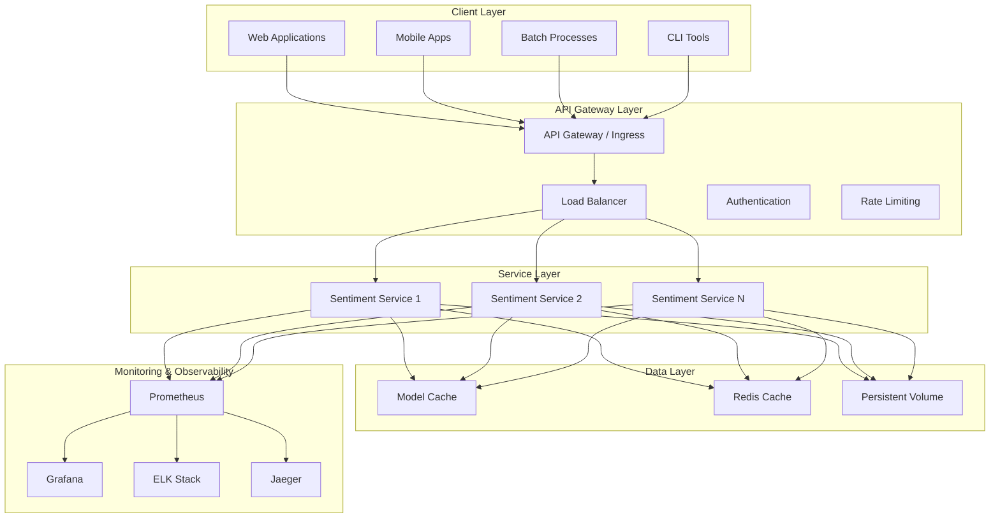
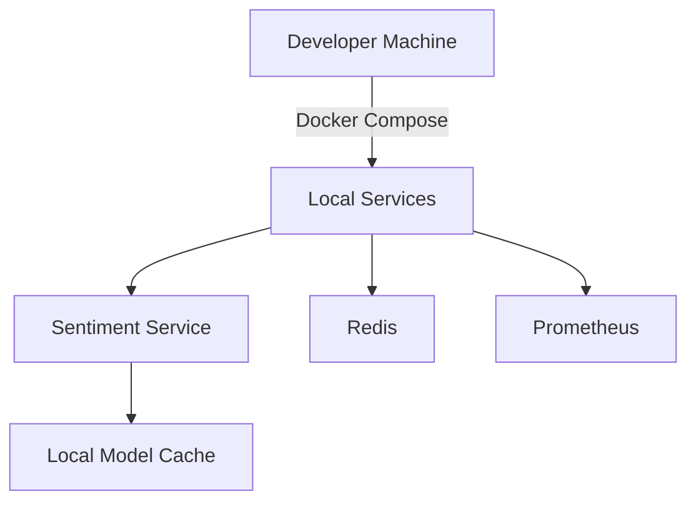
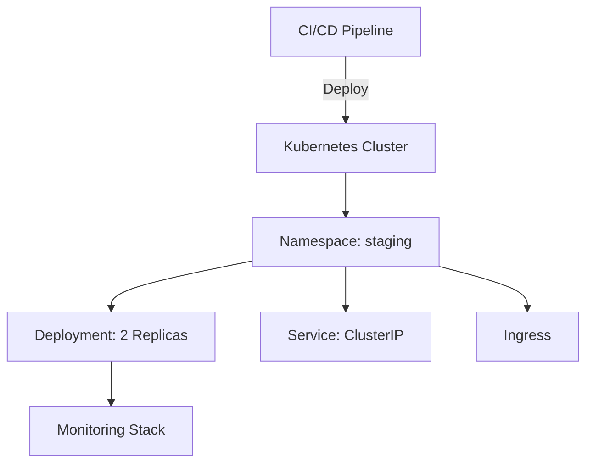
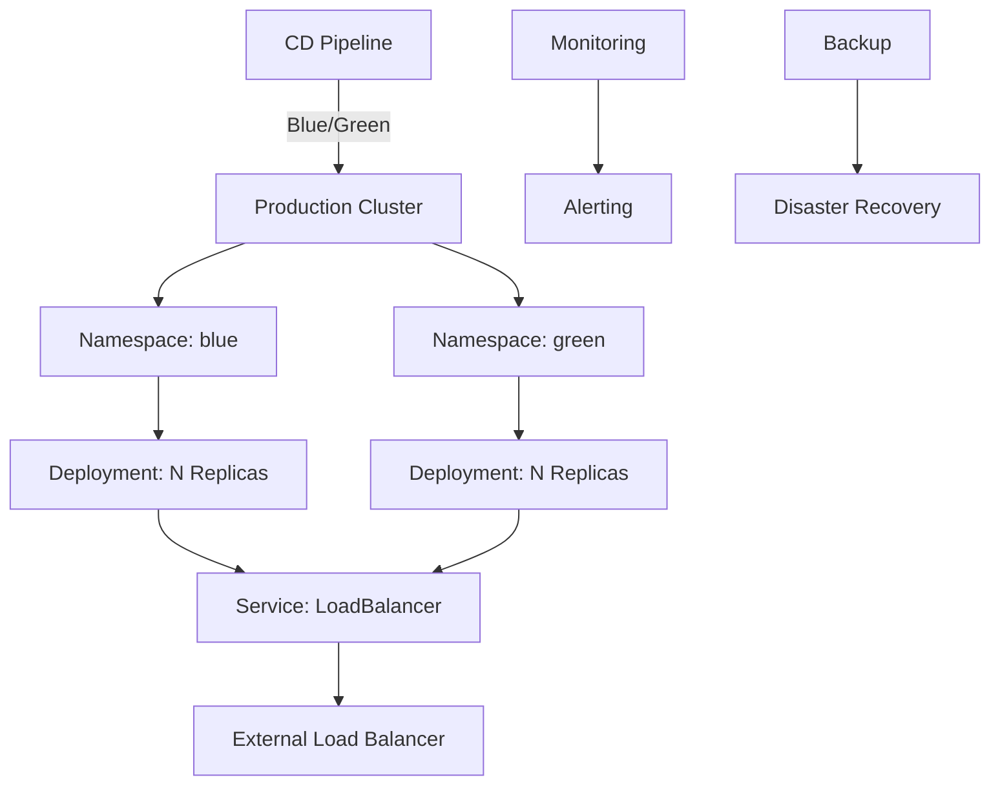

# System Architecture

This document provides a comprehensive overview of the MLOps Sentiment Analysis Microservice architecture, including its components, data flow, and deployment topology.

## Table of Contents
- [Architecture Overview](#architecture-overview)
- [Component Details](#component-details)
- [Data Flow](#data-flow)
- [Deployment Topology](#deployment-topology)
- [Scaling Strategy](#scaling-strategy)
- [Security Considerations](#security-considerations)
- [High Availability](#high-availability)
- [Disaster Recovery](#disaster-recovery)

## Architecture Overview



## Component Details

### 1. Client Layer
- **Web Applications**: React/Angular/Vue.js applications consuming the API
- **Mobile Apps**: iOS/Android applications making API calls
- **Batch Processes**: Scheduled jobs for bulk sentiment analysis
- **CLI Tools**: Command-line interfaces for testing and administration

### 2. API Gateway Layer
- **API Gateway**: Entry point for all client requests
- **Load Balancer**: Distributes traffic across service instances
- **Authentication**: JWT-based authentication and authorization
- **Rate Limiting**: Protects against abuse and ensures fair usage

### 3. Service Layer
- **Stateless Services**: Horizontally scalable service instances
- **Health Checks**: Regular health monitoring and reporting
- **Circuit Breakers**: Prevents cascading failures
- **Request Tracing**: End-to-end request tracking

### 4. Data Layer
- **Model Cache**: Cached ML models for fast inference
- **Redis Cache**: Session and temporary data storage
- **Persistent Volume**: Long-term storage for logs and metrics

### 5. Monitoring & Observability
- **Prometheus**: Metrics collection and alerting
- **Grafana**: Visualization and dashboards
- **ELK Stack**: Centralized logging
- **Jaeger**: Distributed tracing

## Data Flow

### Request Flow
1. Client sends an HTTP request to the API Gateway
2. Request is authenticated and rate-limited
3. Load balancer routes the request to an available service instance
4. Service processes the request (model inference)
5. Response is returned to the client
6. Metrics and logs are collected

### Model Loading Flow
1. Service starts up
2. Checks for cached model
3. If not cached, downloads model from registry
4. Loads model into memory
5. Warms up the model with sample input
6. Starts serving requests

## Deployment Topology

### Development Environment


### Staging Environment


### Production Environment


## Scaling Strategy

### Horizontal Pod Autoscaling (HPA)
```yaml
apiVersion: autoscaling/v2
kind: HorizontalPodAutoscaler
metadata:
  name: sentiment-service
spec:
  scaleTargetRef:
    apiVersion: apps/v1
    kind: Deployment
    name: sentiment-service
  minReplicas: 2
  maxReplicas: 10
  metrics:
  - type: Resource
    resource:
      name: cpu
      target:
        type: Utilization
        averageUtilization: 70
  - type: Resource
    resource:
      name: memory
      target:
        type: Utilization
        averageUtilization: 80
```

### Cluster Autoscaling
- Node auto-provisioning based on resource demands
- Multiple availability zones for high availability
- Spot instances for cost optimization

## Security Considerations

### Network Security
- All internal traffic encrypted with mTLS
- Network policies to restrict pod-to-pod communication
- Private subnets for worker nodes

### Data Protection
- Encryption at rest for sensitive data
- Regular security audits and vulnerability scanning
- Secrets management with Vault

### API Security
- Rate limiting and throttling
- Request validation and sanitization
- CORS and CSRF protection

## High Availability

### Multi-AZ Deployment
- Services deployed across multiple availability zones
- Automatic failover between zones
- Load balancing across zones

### State Management
- Stateless services for horizontal scaling
- Externalized session management
- Distributed caching layer

## Disaster Recovery

### Backup Strategy
- Regular backups of persistent data
- Point-in-time recovery capability
- Geo-redundant storage

### Recovery Objectives
- **RPO (Recovery Point Objective)**: 5 minutes
- **RTO (Recovery Time Objective)**: 15 minutes
- Automated recovery procedures

## Performance Considerations

### Caching Strategy
- Multi-level caching (in-memory, distributed, CDN)
- Cache invalidation policies
- Cache warming on startup

### Database Optimization
- Read replicas for read-heavy workloads
- Connection pooling
- Query optimization and indexing

## Monitoring and Alerting

### Key Metrics
- Request rate and latency
- Error rates and types
- Resource utilization
- Model performance metrics

### Alerting Rules
- P99 latency > 500ms
- Error rate > 1%
- CPU utilization > 80% for 5 minutes
- Memory pressure > 90%
