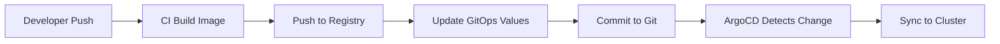

# GitOps Structure

This directory contains all GitOps-related configuration for ArgoCD-based deployments.

## Directory Structure

```
infrastructure/gitops/
├── argocd/                      # ArgoCD installation and configuration
│   ├── install.yaml             # ArgoCD installation reference
│   ├── argocd-config.yaml       # ArgoCD ConfigMaps
│   └── bootstrap.sh             # Bootstrap script
│
├── applications/                # ArgoCD Application CRs
│   ├── development/
│   │   └── mlops-sentiment.yaml
│   ├── staging/
│   │   └── mlops-sentiment.yaml
│   └── production/
│       └── mlops-sentiment.yaml
│
└── environments/                # Environment-specific values (updated by CI)
    ├── development/
    │   └── values.yaml          # Dev environment image tags and config
    ├── staging/
    │   └── values.yaml          # Staging environment image tags and config
    └── production/
        └── values.yaml          # Production environment image tags and config
```

## Quick Start

### 1. Install ArgoCD

```bash
cd argocd
./bootstrap.sh install
```

### 2. Access ArgoCD

```bash
kubectl port-forward svc/argocd-server -n argocd 8080:443

# Get password
kubectl -n argocd get secret argocd-initial-admin-secret \
  -o jsonpath="{.data.password}" | base64 -d

# Access: https://localhost:8080
# Username: admin
```

### 3. Bootstrap Applications

```bash
kubectl apply -f applications/development/
kubectl apply -f applications/staging/
kubectl apply -f applications/production/
```

## How It Works

### 1. CI/CD Pipeline



### 2. Environment Flows

| Environment | Branch    | CI Action          | ArgoCD Sync | Approval |
| ----------- | --------- | ------------------ | ----------- | -------- |
| Development | `develop` | Auto update GitOps | Auto sync   | None     |
| Staging     | `main`    | Auto update GitOps | Auto sync   | None     |
| Production  | `tags`    | Auto update GitOps | Manual sync | Required |

## Configuration

### Repository Access

Update `argocd/argocd-config.yaml`:

```yaml
repositories: |
  - url: https://github.com/arec1b0/KubeSentiment.git
```

### Image Registry

Update `environments/*/values.yaml`:

```yaml
image:
  repository: ghcr.io/arec1b0/kubesentiment
  tag: v1.0.0 # Updated by CI
```

### Application Definitions

Update `applications/*/mlops-sentiment.yaml`:

```yaml
spec:
  source:
    repoURL: https://github.com/arec1b0/KubeSentiment.git
    helm:
      parameters:
        - name: image.repository
          value: ghcr.io/arec1b0/kubesentiment
```

## Usage

### Deploying Changes

**Automatic (Dev/Staging):**

```bash
# Just push code - CI handles the rest
git push origin develop
```

**Manual (Production):**

```bash
# Tag and push
git tag v1.2.3
git push origin v1.2.3

# Manually sync in ArgoCD
argocd app sync mlops-sentiment-production
```

### Check Status

```bash
# List applications
argocd app list

# Get details
argocd app get mlops-sentiment-production

# View diff
argocd app diff mlops-sentiment-production
```

### Rollback

```bash
# Git-based rollback
git revert <commit-hash>
git push

# Or ArgoCD rollback
argocd app rollback mlops-sentiment-production <revision>
```

## Files Managed by CI

⚠️ **DO NOT EDIT MANUALLY** - These files are updated by CI/CD:

- `environments/development/values.yaml`
- `environments/staging/values.yaml`
- `environments/production/values.yaml`

## Files to Customize

✅ **SAFE TO EDIT** - Customize these for your environment:

- `argocd/argocd-config.yaml` - ArgoCD configuration
- `applications/*/mlops-sentiment.yaml` - Application definitions (repo URLs)

## ArgoCD Applications

### Development

- **Name:** `mlops-sentiment-development`
- **Namespace:** `mlops-sentiment-dev`
- **Branch:** `develop`
- **Auto-Sync:** ✅ Yes
- **Auto-Prune:** ✅ Yes

### Staging

- **Name:** `mlops-sentiment-staging`
- **Namespace:** `mlops-sentiment-staging`
- **Branch:** `main`
- **Auto-Sync:** ✅ Yes
- **Auto-Prune:** ✅ Yes

### Production

- **Name:** `mlops-sentiment-production`
- **Namespace:** `mlops-sentiment`
- **Branch:** `HEAD` (tags)
- **Auto-Sync:** ❌ No (manual)
- **Auto-Prune:** ❌ No

## Sync Policies

### Development

```yaml
syncPolicy:
  automated:
    prune: true # Remove old resources
    selfHeal: true # Auto-fix drift
```

### Production

```yaml
syncPolicy:
  automated: null # Manual sync only
```

## Troubleshooting

### Application Not Syncing

```bash
# Force refresh
argocd app get mlops-sentiment-production --refresh

# Check sync status
argocd app get mlops-sentiment-production

# View logs
argocd app logs mlops-sentiment-production
```

### Out of Sync

```bash
# Compare with Git
argocd app diff mlops-sentiment-production

# Hard refresh
argocd app get mlops-sentiment-production --hard-refresh

# Sync with prune
argocd app sync mlops-sentiment-production --prune
```

### Repository Access Issues

```bash
# Check repository connection
argocd repo get https://github.com/arec1b0/KubeSentiment.git

# Update credentials
kubectl edit secret -n argocd <secret-name>
```

## Emergency Procedures

### Manual Helm Deployment

If ArgoCD is unavailable:

```bash
# Use emergency workflow
# GitHub: .github/workflows/deploy.yml
# GitLab: .gitlab-ci.yml (deploy:*:emergency jobs)
```

### Disable Auto-Sync

```bash
# Temporarily disable auto-sync
kubectl patch application mlops-sentiment-production -n argocd \
  --type=json \
  -p='[{"op": "remove", "path": "/spec/syncPolicy/automated"}]'
```

## Best Practices

1. ✅ Never modify cluster state directly
2. ✅ All changes through Git commits
3. ✅ Review diffs before production sync
4. ✅ Use semantic versioning for production (v1.2.3)
5. ✅ Test in development first
6. ✅ Keep GitOps repo clean
7. ✅ Monitor sync failures
8. ✅ Set up ArgoCD notifications
9. ✅ Regular backups of ArgoCD state
10. ✅ Document changes in commit messages

## Documentation

- [GitOps with ArgoCD Guide](../../docs/deployment/GITOPS_ARGOCD.md)
- [Migration Guide](../../docs/deployment/GITOPS_MIGRATION.md)
- [ArgoCD Documentation](https://argo-cd.readthedocs.io/)
- [Helm with ArgoCD](https://argo-cd.readthedocs.io/en/stable/user-guide/helm/)

## Support

For issues:

1. Check ArgoCD logs: `kubectl logs -n argocd -l app.kubernetes.io/name=argocd-server`
2. Check application status: `argocd app get <app-name>`
3. Review Git history
4. Consult [troubleshooting guide](../../docs/deployment/GITOPS_ARGOCD.md#troubleshooting)

---

**Last Updated:** 2025-12-16
**Version:** 1.0.0
